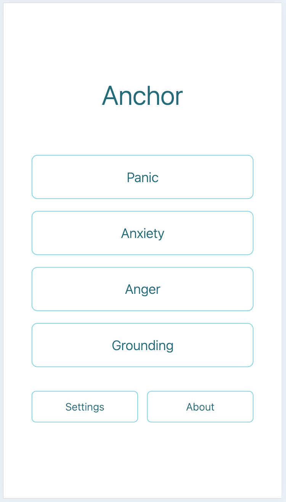

# Anchor / Ancla

A minimal, open-source grounding app for overwhelming moments.

[](LICENSE)
[](#)

<!-- Add your screenshot or demo GIF here -->
<!--  -->

## About

Anchor is a simple tool for when emotions feel overwhelming. It provides gentle phrases and reminders to help you stay grounded during moments of panic, anxiety, sadness, or anger.

**Design Philosophy:**
- **Minimal** — Clean, distraction-free interface
- **Private** — All data stays on your device
- **Customizable** — Add your own phrases and modes
- **Evidence-based** — Techniques backed by science and reviewed by experts

> **Important:** Anchor is not a medical tool or therapy replacement. It's simply a reading tool that provides phrases you can reflect on during difficult moments. If you're experiencing a mental health crisis, please reach out to a professional or crisis helpline.

## Features

- **Five Built-in Modes** — Panic, Anxiety, Sadness, Anger, and Grounding
- **Custom Modes** — Create your own modes with personalized names
- **Custom Phrases** — Add, edit, or hide phrases for any mode
- **Multi-language** — English, Spanish (Español), and Portuguese (Português)
- **Themes** — Light, Dark, or Auto (follows system)
- **Cross-platform** — iOS, Android, and Web
- **Privacy-first** — No accounts, no analytics, no tracking
- **Evidence-based** — Techniques backed by science and reviewed by mental health experts

## Getting Started

### Prerequisites

- [Node.js](https://nodejs.org/) (LTS version recommended)
- [Expo CLI](https://docs.expo.dev/get-started/installation/)

### Installation

```bash
# Clone the repository
git clone https://github.com/NicoDeGiacomo/anchor.git
cd anchor

# Install dependencies
npm install

# Start the development server
npm start
```

### Running the App

After starting the development server:

| Platform | Command |
|----------|---------|
| iOS Simulator | Press `i` |
| Android Emulator | Press `a` |
| Web Browser | Press `w` |
| Physical Device | Scan the QR code with [Expo Go](https://expo.dev/client) |

## Project Structure

```
anchor/
├── app/                # Screens and navigation (Expo Router)
│   ├── (tabs)/        # Tab screens (home, settings, about)
│   └── mode/          # Mode display screen
├── components/        # Reusable React components
├── content/           # Phrase data (JSON, multi-language)
│   ├── panic/
│   ├── anxiety/
│   ├── sadness/
│   ├── anger/
│   └── grounding/
├── contexts/          # React Context providers (language, theme)
├── hooks/             # Custom React hooks
├── utils/             # Utility functions
├── assets/            # Images, fonts, icons
└── scripts/           # Build scripts
```

## Customization

### Adding/Editing Phrases

1. Open the app and go to **Settings**
2. Under any mode, tap **Edit Phrases**
3. Add new phrases or hide existing ones

### Creating Custom Modes

1. Go to **Settings**
2. Tap **Add Mode**
3. Enter a name for your custom mode
4. Add phrases to your new mode

### Language & Theme

In **Settings**, you can:
- Switch between English, Spanish, and Portuguese
- Choose Light, Dark, or Auto theme

## Tech Stack

- **[Expo](https://expo.dev/)** ~54.0 — React Native framework
- **[React Native](https://reactnative.dev/)** 0.81 — Cross-platform mobile development
- **[React](https://react.dev/)** 19 — UI library
- **[TypeScript](https://www.typescriptlang.org/)** — Type-safe JavaScript
- **[Expo Router](https://docs.expo.dev/router/introduction/)** — File-based routing
- **[AsyncStorage](https://react-native-async-storage.github.io/async-storage/)** — Local data persistence
- **[Reanimated](https://docs.swmansion.com/react-native-reanimated/)** — Smooth animations

## Science-Backed Approach

Anchor's grounding techniques are:

- **Evidence-based** — Rooted in established psychological practices
- **Expert-reviewed** — Techniques reviewed by mental health professionals
- **Research-informed** — Based on proven methods for managing anxiety and panic

We are committed to providing scientifically-validated approaches you can trust.

## Privacy

Anchor is designed with privacy as a core principle:

- **100% Local** — All your data (phrases, settings, preferences) is stored only on your device
- **No Accounts** — No sign-up, no login required
- **No Analytics** — We don't track your usage
- **No Network** — The app works completely offline

## Contributing

Contributions are welcome! Whether it's:

- Reporting bugs
- Suggesting features
- Adding translations
- Improving documentation
- Submitting pull requests

Please feel free to open an issue or submit a PR.

## Publishing

See [PUBLISHING.md](PUBLISHING.md) for detailed instructions on building and publishing to:
- iOS App Store
- Google Play Store
- Web

## Support

If you find Anchor helpful and want to support its development:

- [Ko-fi](https://ko-fi.com/nicodegiacomo)
- [Cafecito](https://cafecito.app/nicodegiacomo)

## Links

- [GitHub Repository](https://github.com/NicoDeGiacomo/anchor)
- [LinkedIn](https://www.linkedin.com/in/nicolasdegiacomo/)

## License

This project is licensed under the MIT License — see the [LICENSE](LICENSE) file for details.

---

Made with care for those moments when you need a gentle anchor.
